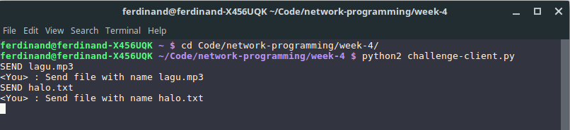

# Penjelasan Source Code Challenge 4 Mar

## Outline
- [Penjelasan Source Code Challenge 4 Mar](#penjelasan-source-code-challenge-4-mar)
    - [Outline](#outline)
    - [Deskripsi Umum](#deskripsi-umum)
    - [Client](#client)
    - [Server](#server)
    - [Screenshot](#screenshot)


## Deskripsi Umum
- Karena terdapat dua tipe pesan yaitu pesan file dan pesan chat maka dibuat penanda sebuah pesan 
```python
TYPE_FILE = 'FILE'
TYPE_MESSAGE = 'MESG'
```
- Serta untuk menandakan bahwa file pesan tersebut telah sampai akhir maka dibuat flag
```python
TYPE_END = 'EOF'
```

## Client
- Jika pesan berupa pesan file, maka file tersebut dikirimkan dengan dibungkus dengan format `FILE:<nama file>|<binary file>EOF`
- Sehingga untuk mengirimkan file bisa menggunakan potongan kode berikut.
```python
server_socket.send(TYPE_FILE+':'+message[5:]+'|')
with open(PATH_CLIENT+message[5:], 'rb') as f:
    chunk = f.read(MAX_BUFFER)
    while chunk:
        server_socket.send(chunk)
        chunk = f.read(MAX_BUFFER)
server_socket.send(TYPE_END)
sys.stdout.write("<You> : ")
sys.stdout.write("Send file with name "+ message[5:])
sys.stdout.write("\n")
sys.stdout.flush()
```
- Kemudian untuk penerimaan file hasil broadcast dari server, terlebih dahulu mengambil `<nama file>` dari pesan yang dikirimkan
```python
message = socket.recv(MAX_BUFFER)
TYPE = message[:4]
if TYPE == TYPE_FILE:
    chunk = message.split('|')
    if len(chunk) == 2:
        filename = chunk[0][5:]
        chunk = chunk[1]
    else :
        chunk = ''
        filename = chunk[0][5:] 
```
Dilanjutkan dengan membuat file dengan format `<random>_<nama file>`, kemudian menerima binary file dari server, perulangan penerimaan binary file dari server berhenti saat ditemui flag `TYPE_END` yang menandakan akhir dari file.
```python
with open(PATH_CLIENT+hash_random+'_'+filename, 'wb') as f:
    lanjut = True
    f.write(chunk)
    if TYPE_END in chunk:
        chunk = chunk.replace(TYPE_END,'')
        f.write(chunk)
        lanjut = False
    while lanjut:
        chunk = socket.recv(MAX_BUFFER)
        if TYPE_END in chunk:
            chunk = chunk.replace(TYPE_END,'')
            f.write(chunk)
            break
        f.write(chunk)
print 'file received :' + hash_random+'_'+filename
```
- Sementara untuk message biasa dikirimkan dan diterima dengan format `MESG:<pesan>`


## Server
- Jika pesan file maka file tersebut terbungkus dengan format `FILE:<nama file>|<binary file>EOF` seperti yang terdefinisi pada client
- Sehingga untuk menerimanya, kita perlu mengambil `<nama file>` dari format diatas menggunakan potongan kode berikut
```python
chunk = message.split('|')
print chunk
if len(chunk) == 2:
    filename = chunk[0][5:]
    chunk = chunk[1]
else :
    filename = chunk[0][5:] 
    chunk = ''
print PATH_SERVER+filename
```
- Setelah mengambil `nama file`, dilanjutkan dengan membuat file dengan nama file yang sama dengan client.
Kemudian menerima file binary dari client sampai ditemui `TYPE_END`, kemudian membroadcast file tersebut.
```python
with open(PATH_SERVER+filename, 'wb') as f:
    lanjut = True
    f.write(chunk)
    if TYPE_END in chunk:
        chunk = chunk.replace(TYPE_END,'')
        f.write(chunk)
        lanjut = False
    while lanjut:
        chunk = connection.recv(MAX_BUFFER)
        if TYPE_END in chunk:
            chunk = chunk.replace(TYPE_END,'')
            f.write(chunk)
            break
        f.write(chunk)
broadcast_file(PATH_SERVER+filename, connection)
```
- Broadcast file dilakukan dengan mengirimkan file ke setiap client non pengirim, dengan membungkusnya dengan format `FILE:<nama file>|<binary file>EOF`.
```python
for client in list_of_clients:
    if client != connection:
        print filename
        with open(filename, 'rb') as f :
            filename_new = filename.replace(PATH_SERVER, '')
            try :
                client.send(TYPE_FILE+':'+filename_new+'|')
                chunk = f.read(MAX_BUFFER)
                while chunk:
                    client.send(chunk)
                    chunk = f.read(MAX_BUFFER)
                client.send(TYPE_END)
            except:
                client.close()
                remove_from_list(client)
```
- Sementara untuk message biasa dikirimkan dan diterima dengan format `MESG:<pesan>`


## Screenshot
- Client 1 mengirimkan `lagu.mp3` dan `halo.txt`

- Client 2 menerima `lagu.mp3` dan `halo.txt`

- Server 


- Client 1 & Client 2 chat


- Server 


